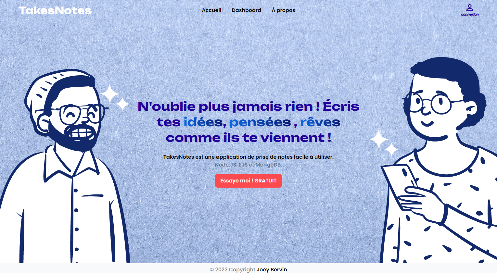

# TakeNotes

[](https://render.com/deploy)




## You need:
- Database (MongoDB)
- Google Console Account to create the API Auth Key's
- Facebook Console Account to create the API Auth Key's
- Cloudinary account to store your image

## Create .env file
Create a .env file to store your credentials. Example below:

```
SESSION_SECRET= CHOOSE_YOUR_SESSION_SECRET
JWT_SECRET_KEY= CHOOSE_JWT_SECRET_KEY

MONGODB_URI=mongodb+srv://<username>:<password>@s-projects.wxalqev.mongodb.net/<databasename>?retryWrites=true&w=majority
MONGODB_USERNAME=<username>
MONGODB_PASSWORD=<password>

GOOGLE_CLIENT_ID= YOUR_GOOGLE_ID_HERE
GOOGLE_CLIENT_SECRET= YOUR_GOOGLE_CLIENT_SECRET_HERE
GOOGLE_CALLBACK_URL=http://localhost:5000/google/callback

FACEBOOK_APP_ID= YOUR_FACEBOOK_ID_HERE
FACEBOOK_APP_SECRET= YOUR_fACEBOOK_CLIENT_SECRET_HERE
FACEBOOK_CALLBACK_URL=http://localhost:5000/facebook/callback

CLOUDINARY_CLOUND_NAME= YOUR_CLOUDINARY_CLOUND_NAME
CLOUDINARY_API_KEY= YOUR_CLOUDINARY_API_KEY
CLOUDINARY_API_SECRET= YOUR_CLOUDINARY_API_SECRET
CLOUDINARY_URL= YOUR_CLOUDINARY_URL

SALT_ROUNDS = NUMBER
```

## Installation
To install and run this project - install dependencies using npm and then start your server:

```
$ npm install
$ npm start
```